# Demo

## Select and Install a Mobile Wallet

There are several mobile wallets you could choose from for this demo.  You can find a list of them here; [Get a Mobile Wallet](https://vonx.io/getwallet)

For the purposes of this document we are using the Trinsic Wallet

## Switch to the Sovrin StagingNet Ledger

The agents used in this demo are connected to the Sovrin StagingNet Blockchain Ledger.  Therefore you need to configure your mobile wallet to use the same ledger.

On the home screen of your mobile wallet, access settings by clicking on the hamburger (bars) in the top left of the screen.  On the **Settings** screen click **Network**.  On the **Network Selection** Screen select **Sovrin Staging**.  Click the back arrows until you are back at the Home/Actions screen.
 
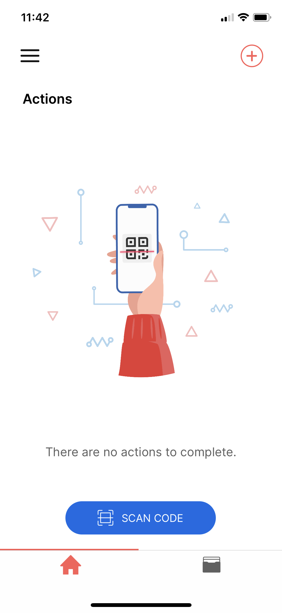
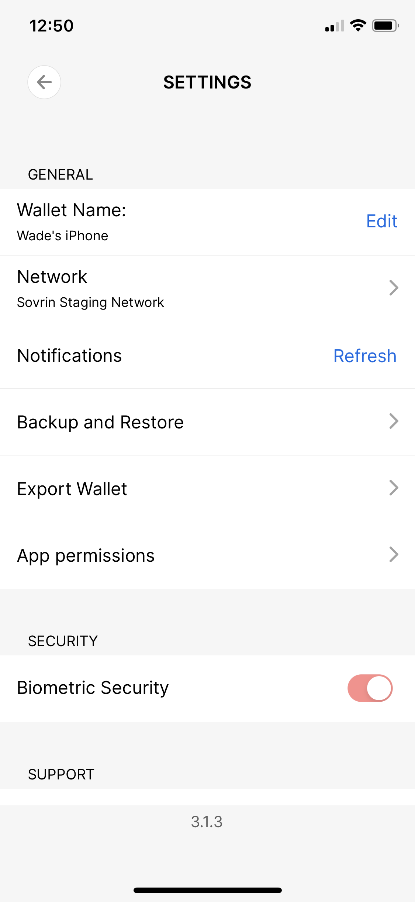
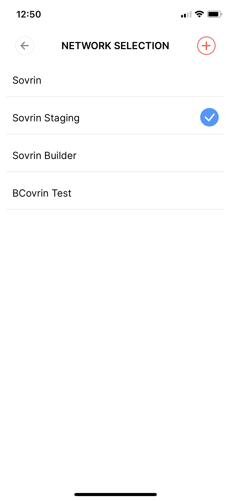

## Get Your Credentials

Browse to the [A2A - Trust Over IP Issuer](https://a2a-issuer-test.pathfinder.gov.bc.ca/) application.

Agree to the terms of service.
 
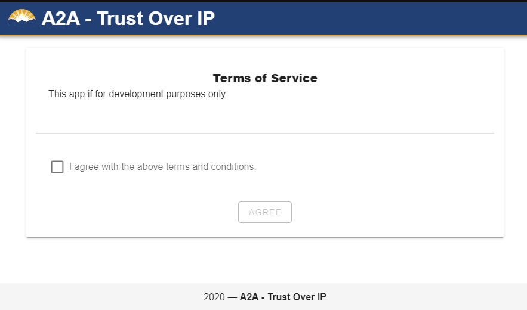

On the log-in prompt, select **IDIR** from the right-hand menu, and login with your IDIR account.
 
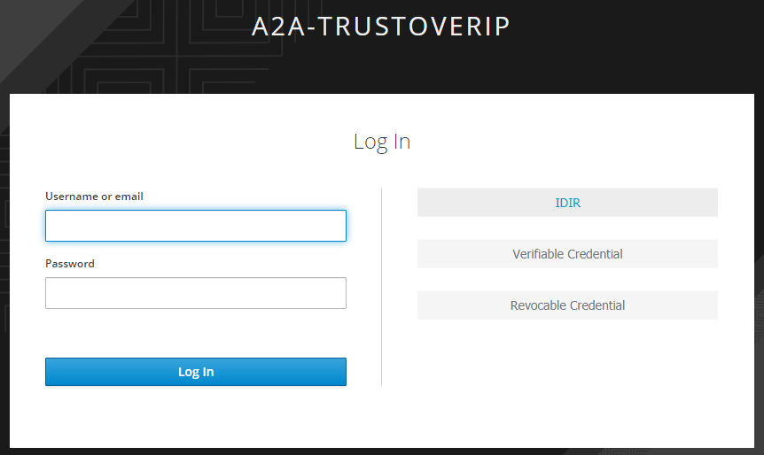
 
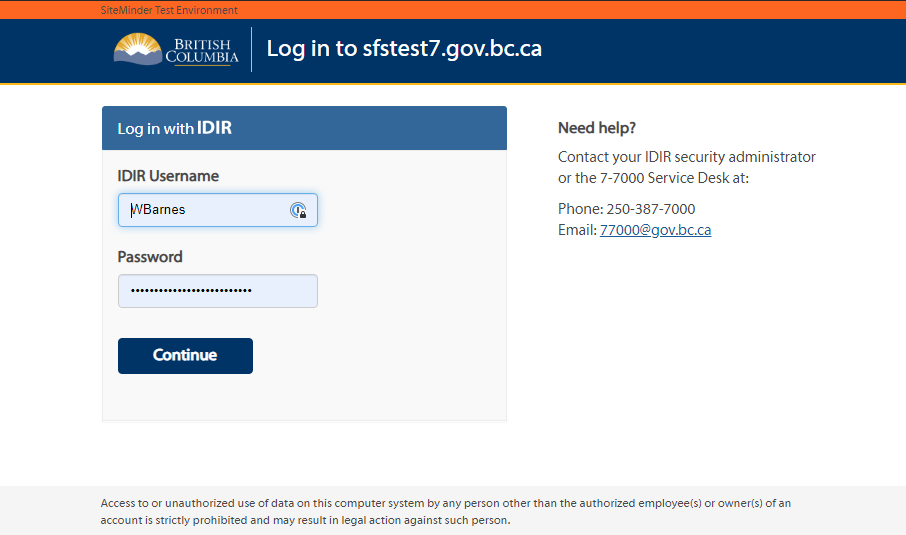

Fill out the credential request form, then click **Request Credential**.  Please note, **this is not** how you would ever request and issue a credential under real world circumstances.  This process is used solely for demonstration and ease of use purposes.  It demonstrates that a credential can contain an arbitrary number of user (issuer) definable attributes.  In a real world scenario a verifiable credential would generally only be issued once some verification and governance process was carried out to ensure the recipient of the credential was full vetted.
 
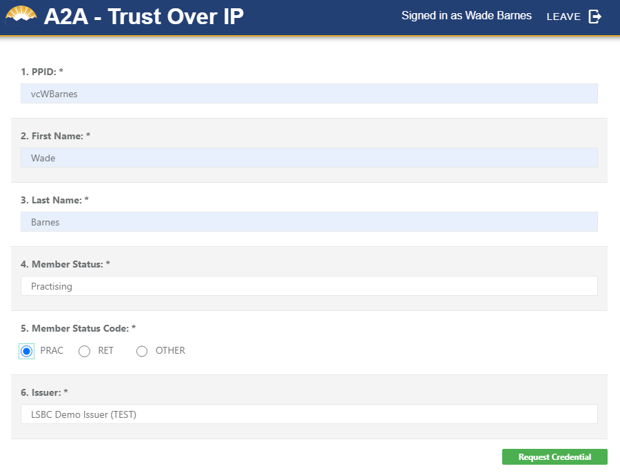

Confirm the details of the credential request and click **PROCEED**.
 
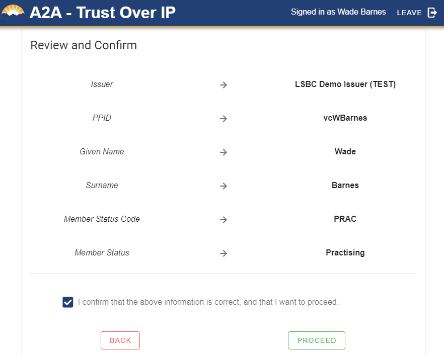

When the **Connect with Issuer** QR Code appears open your mobile wallet and scan the code.
 
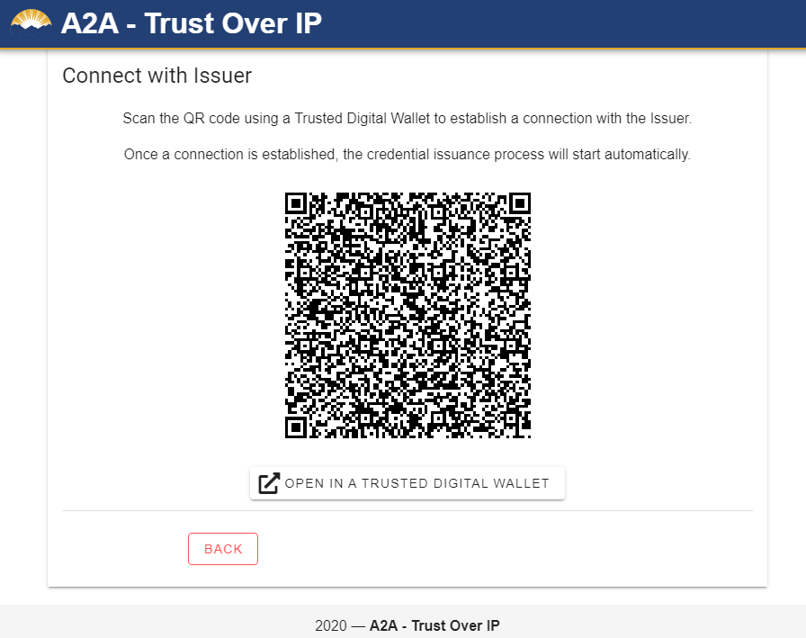
 

 
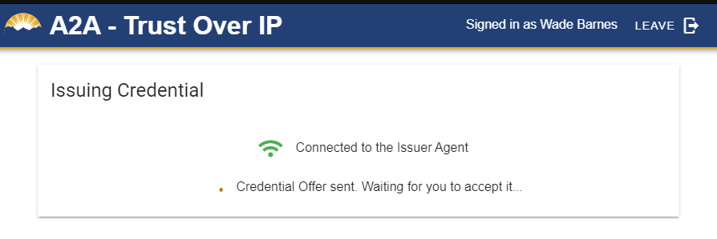

Accept the connection offer.
 
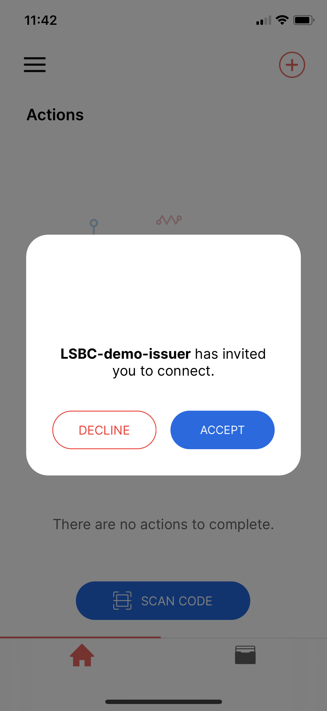

Accept the credential.
 
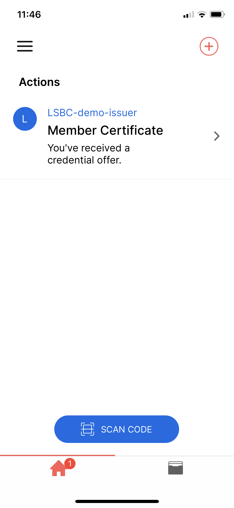
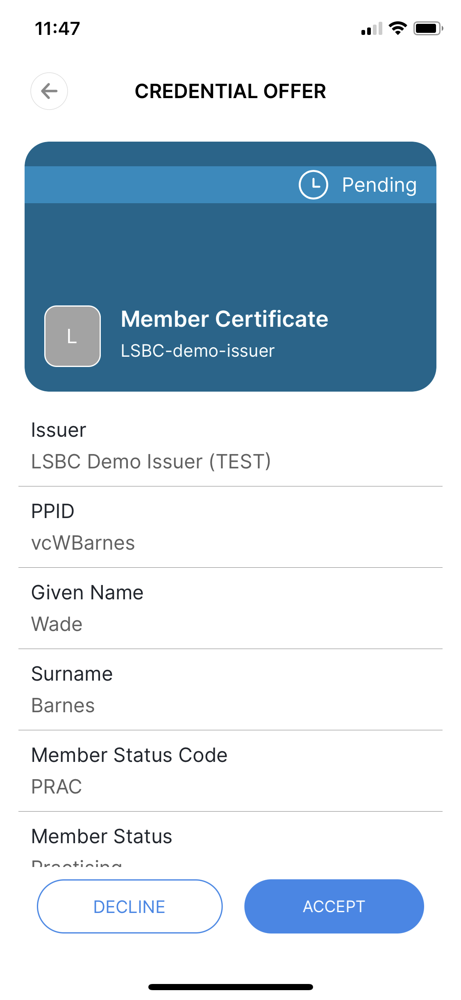
 
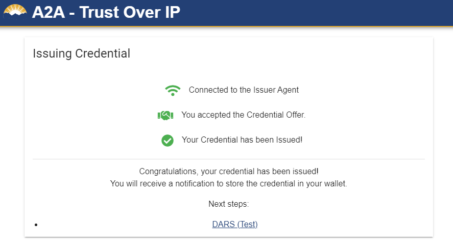

**DO NOT** click the **DARS (Test)** link at the bottom of the completed **Issuing Credential** screen.  We won't be using that application for this demo as it is not publicly accessible.

## Login to the CSB Audio Demo

Browse to the [CSB Audio Demo](https://csb-audio-demo-test.apps.silver.devops.gov.bc.ca/) application, and click on **Access Site**
 
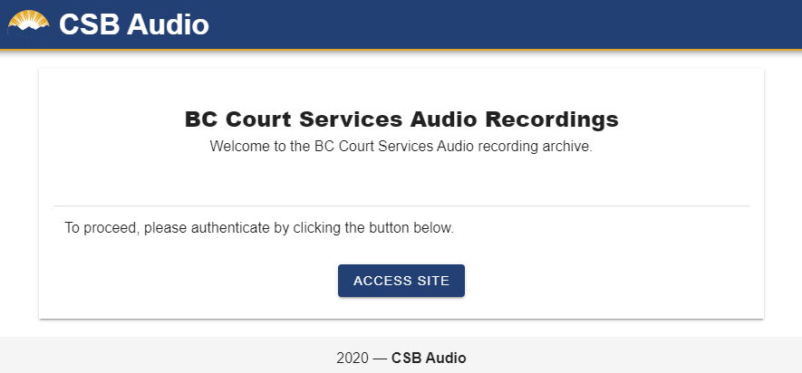

On the log-in prompt, select **Revocable Credential** from the right-hand menu.
 
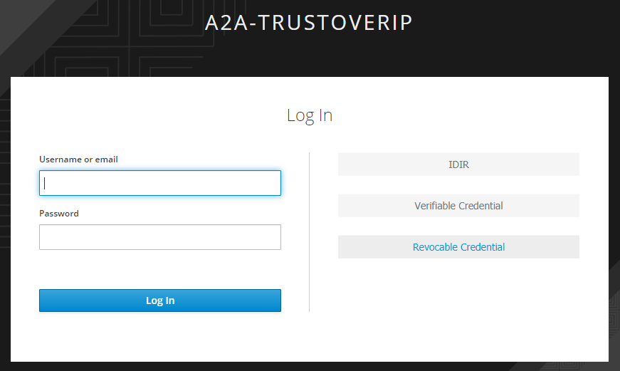

Then the proof request QR Code (Authentication Request) appears, scan it with your mobile wallet.
 
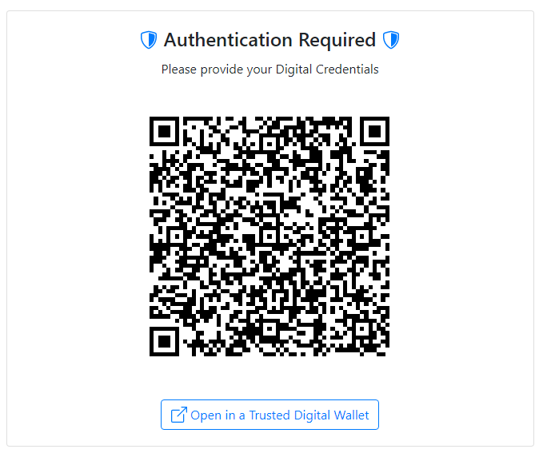
 

Review the details of the request in you wallet, and click **Present**
 
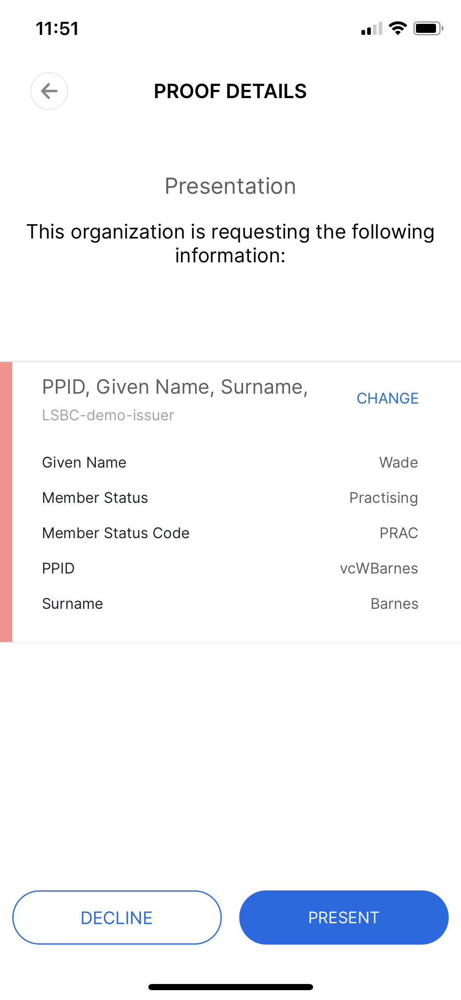

If all goes well your proof will be accepted and you will be logged into the application.  As this is a PoC, the application is nothing more than a screenshot of the actual A2A application's search screen.
 
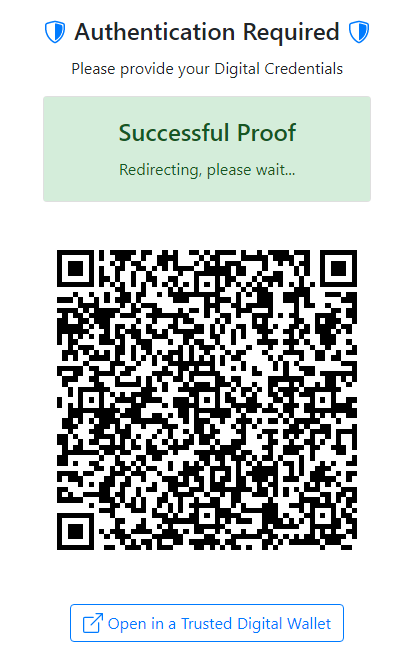
 
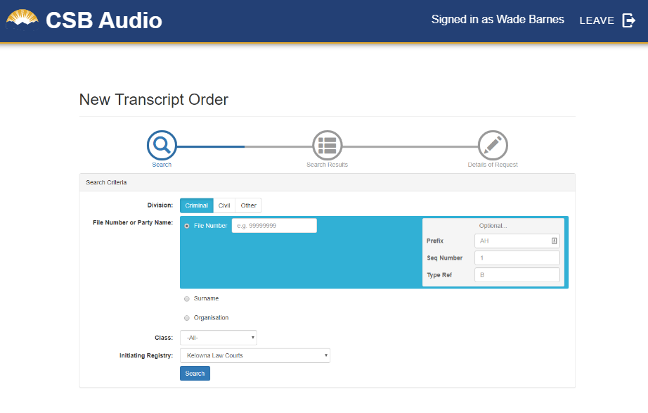

Congratulations, you have just used verifiable credentials to authenticate with and application.